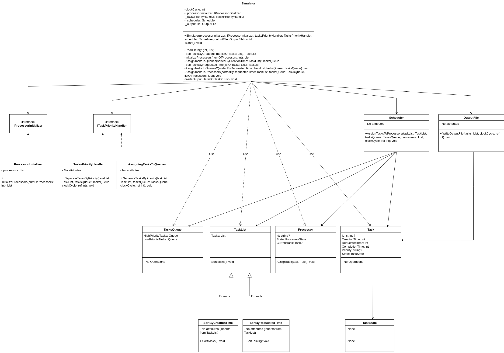

# CPU Task Scheduler Simulator

This project is a CPU task scheduler simulator written in C#. It simulates the behavior of a CPU as it processes tasks, assigning them to different processors based on their priority and the current state of the CPU.

## Features

- Multiple processor support: The simulator can work with any number of processors.
- Priority-based task handling: Tasks are handled based on their priority - high priority tasks are processed before low priority tasks.
- Detailed task attributes: Each task has attributes like creation time, requested time, completion time, and priority.
- Detailed processor state tracking: Each processor's state (busy or idle) is tracked accurately throughout the simulation.
- Task state tracking: Each task's state (waiting, executing, completed) is tracked throughout the simulation.
- Task scheduling: The simulator includes a scheduler that assigns tasks to processors based on their availability and the task priority.
- Output: The simulator writes the output (task information and total clock cycles) to an output file.

## Classes

The project contains several classes, including:

- `Program`: The main class where the simulation is initiated.
- `Simulator`: The class that handles the simulation process.
- `Processor`: Represents a CPU processor.
- `Task`: Represents a task to be processed.
- `TaskList`: An abstract class representing a list of tasks.
- `SortByCreationTime` and `SortByRequestedTime`: Classes for sorting tasks by creation time and requested time respectively.
- `TasksQueue`: Represents a queue of tasks, separated into high and low priority tasks.
- `Scheduler`: Assigns tasks to processors based on their availability and task priority.
- `OutputFile`: Writes the simulation output to a file.

The project also contains several interfaces like `IProcessorInitializer` and `ITasksPriorityHandler` for better abstraction and dependency inversion.

## Usage

To use the simulator, you need to:

1. Clone the repository
2. Open the solution file in Visual Studio (or any other C# IDE)
3. Run the `Program` class

